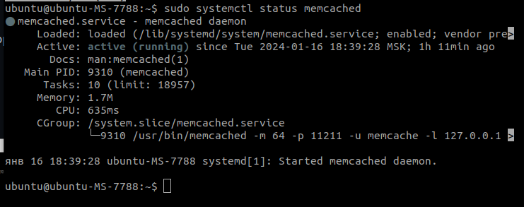
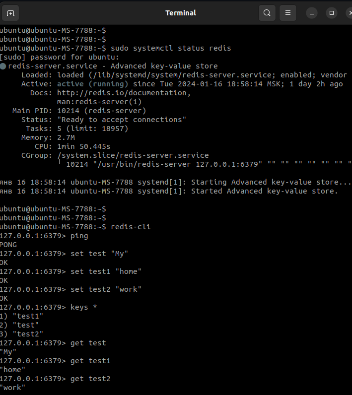
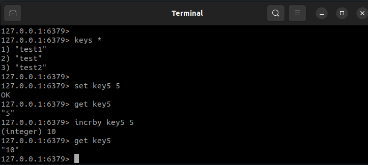

# Домашнее задание к занятию «Кеширование Redis/memcached» - `Музыченко Сергей`

---

### Задание 1

    Приведите примеры проблем, которые может решить кеширование.

Приведите ответ в свободной форме.

---

** 123456789 **

---

### Задание 2

    Установите и запустите memcached.

Приведите скриншот systemctl status memcached, где будет видно, что memcached запущен.

---

---

### Задание 3

    Запишите в memcached несколько ключей с любыми именами и значениями, для которых выставлен TTL 5.

Приведите скриншот, на котором видно, что спустя 5 секунд ключи удалились из базы.

---

---

### Задание 4

    Запишите в Redis несколько ключей с любыми именами и значениями.

Через redis-cli достаньте все записанные ключи и значения из базы, приведите скриншот этой операции.

---

---

### Задание 5*

    Запишите в Redis ключ key5 со значением типа "int" равным числу 5. Увеличьте его на 5, чтобы в итоге в значении лежало число 10.

Приведите скриншот, где будут проделаны все операции и будет видно, что значение key5 стало равно 10.

---

