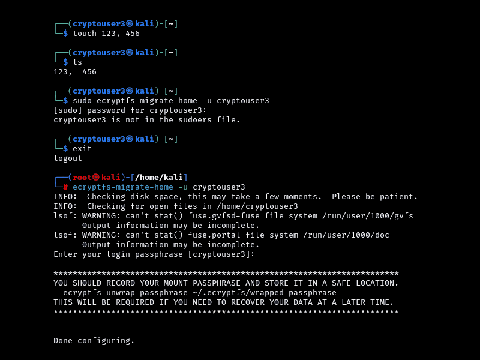
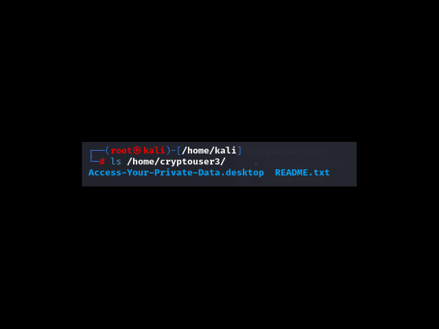
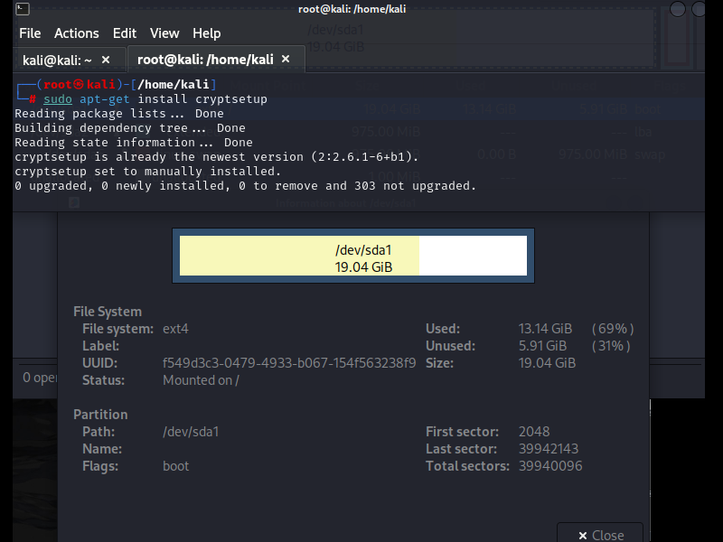
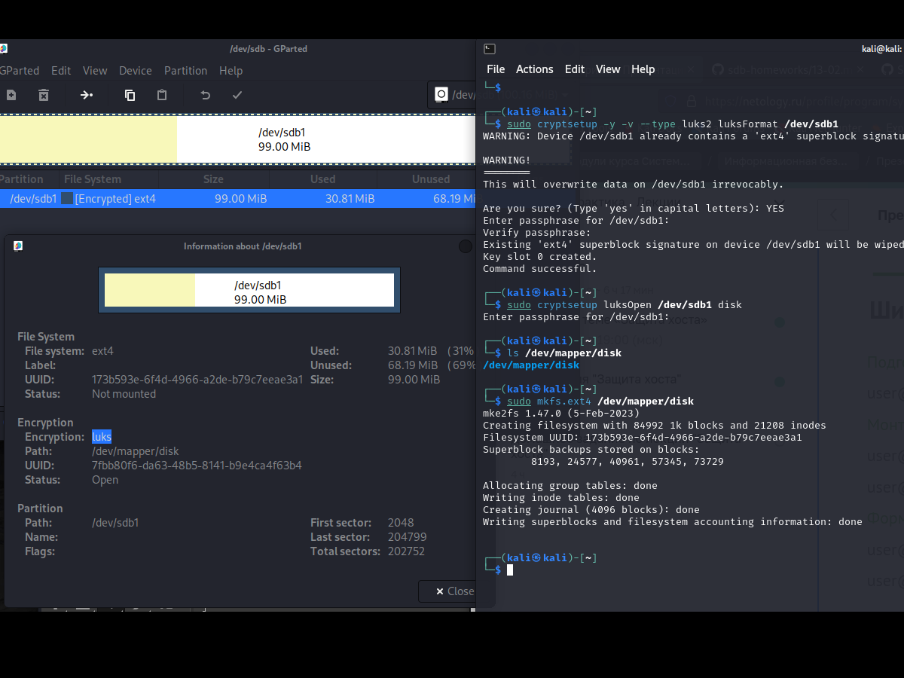
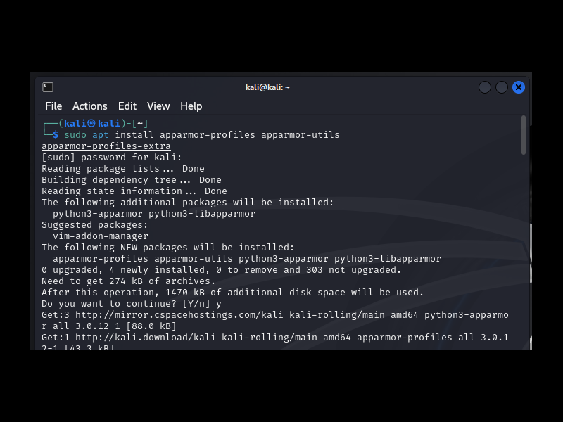
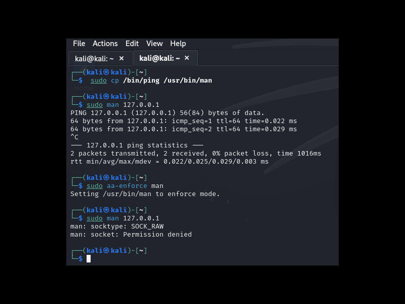
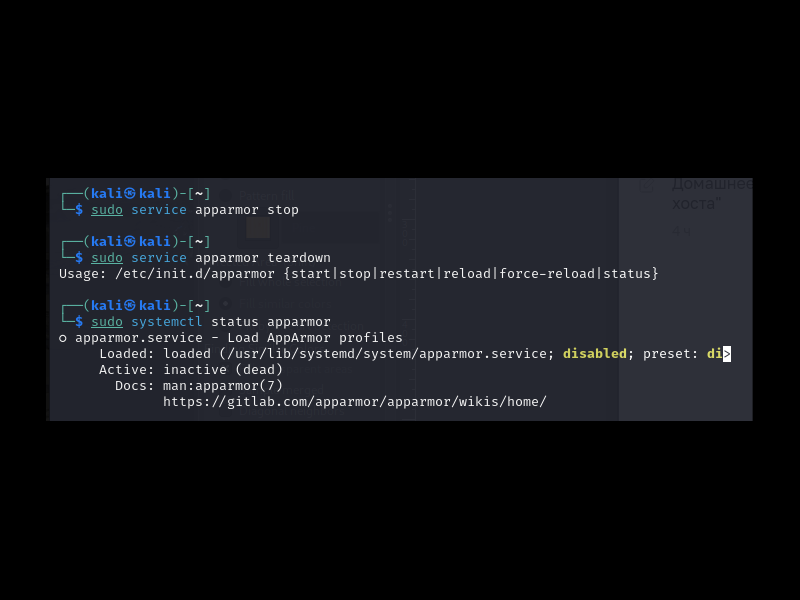

# Домашнее задание к занятию «Защита хоста» - `Музыченко Сергей`

### Задание 1. 

    Установите eCryptfs.
    Добавьте пользователя cryptouser.
    Зашифруйте домашний каталог пользователя с помощью eCryptfs.

В качестве ответа пришлите снимки экрана домашнего каталога пользователя с исходными и зашифрованными данными.

Решение: 

---

### Задание 2. 

    Установите поддержку LUKS.
    Создайте небольшой раздел, например, 100 Мб.
    Зашифруйте созданный раздел с помощью LUKS.

В качестве ответа пришлите снимки экрана с поэтапным выполнением задания.

Решение: 

---

### Задание 3*. 

    Установите apparmor.
    Повторите эксперимент, указанный в лекции.
    Отключите (удалите) apparmor.

В качестве ответа пришлите снимки экрана с поэтапным выполнением задания.

Решение: 

---

