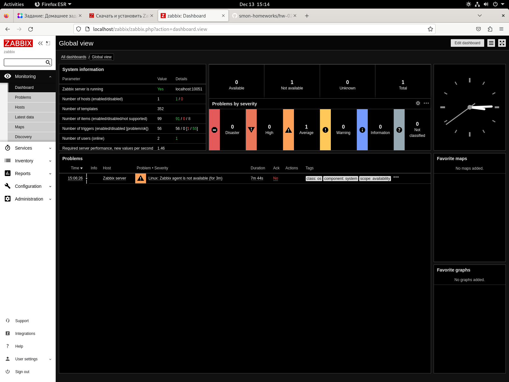
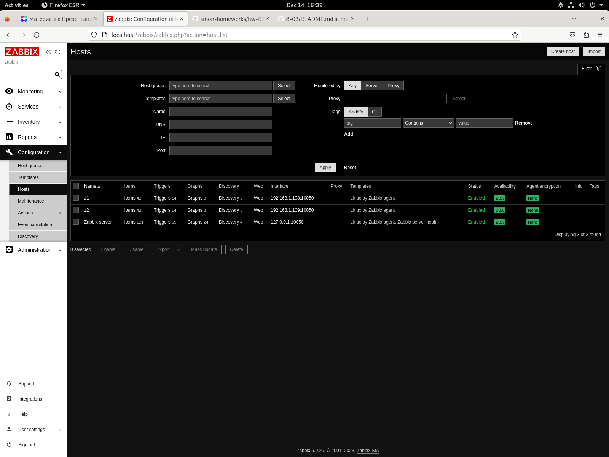
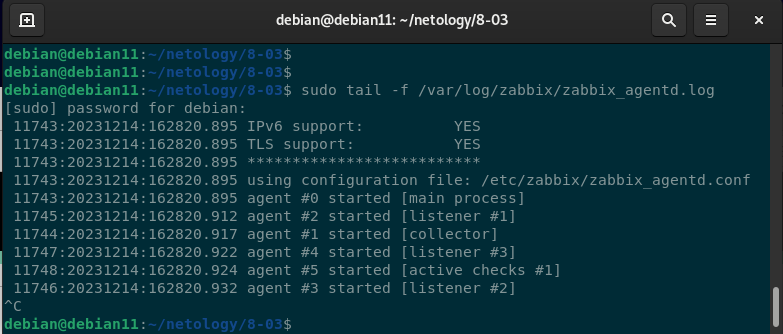
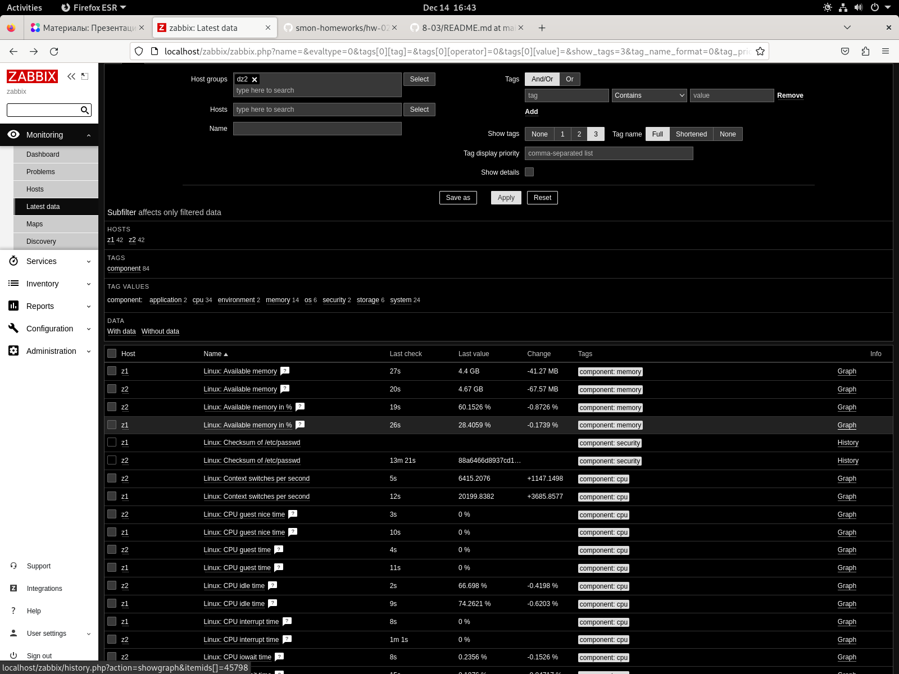
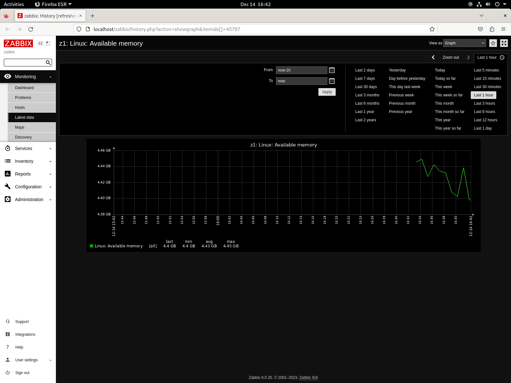

# Домашнее задание к занятию "`Zabbix 1`" - `Музыченко Сергей`

---

### Задание 1

1. `Прикрепите в файл README.md скриншот авторизации в админке.`

2. `Приложите в файл README.md текст использованных команд в GitHub.`
debian@debian11:~$ mkdir netology

debian@debian11:~$ cd netology/

debian@debian11:~/netology$ git init

debian@debian11:~/netology$ git clone https://github.com/SergeyMuzychenko/8-03

debian@debian11:~/netology$ cd 8-03/

debian@debian11:~/netology/8-03$ nano README.md 

debian@debian11:~/netology/8-03$ git add .

debian@debian11:~/netology/8-03$ git commit -m "zabbix_dz1"

debian@debian11:~/netology/8-03$ git push origin

---
### Задание 2

1. `Приложите в файл README.md скриншот раздела Configuration > Hosts, где видно, что агенты подключены к серверу`

2. `Приложите в файл README.md скриншот лога zabbix agent, где видно, что он работает с сервером`

3. `Приложите в файл README.md скриншот раздела Monitoring > Latest data для обоих хостов, где видны поступающие от агентов данные.`

---

---
