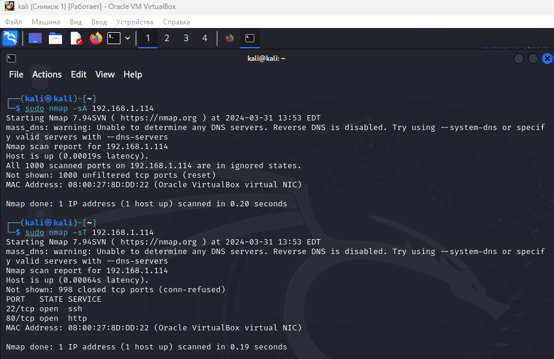
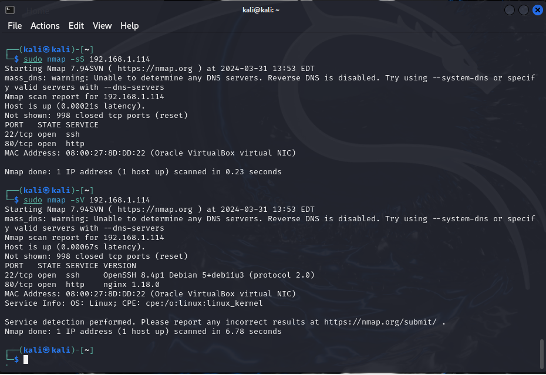
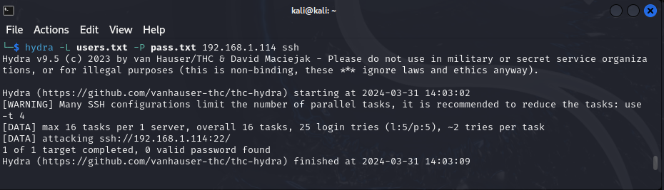
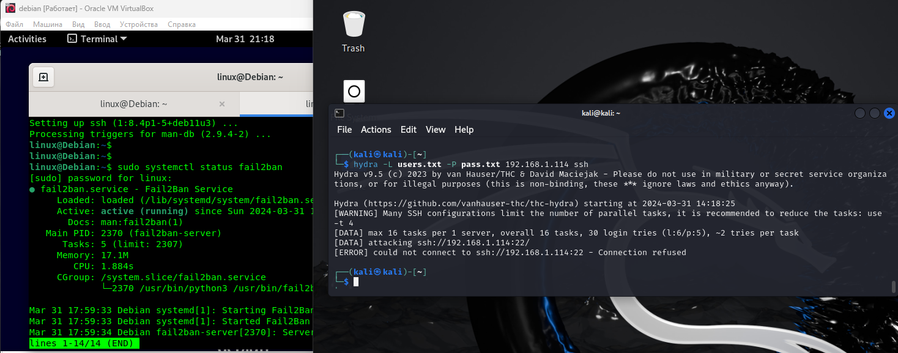

# Домашнее задание к занятию «Защита сети» - `Музыченко Сергей`

### Задание 1. 

Проведите разведку системы и определите, какие сетевые службы запущены на защищаемой системе:

sudo nmap -sA < ip-адрес >

sudo nmap -sT < ip-адрес >

sudo nmap -sS < ip-адрес >

sudo nmap -sV < ip-адрес >

Решение: 

сканирует и показывает открытые порты, название и версии этих служб.

---

### Задание 2. 

Проведите атаку на подбор пароля для службы SSH:

hydra -L users.txt -P pass.txt < ip-адрес > ssh

Настройка hydra:
создайте два файла: users.txt и pass.txt;
в каждой строчке первого файла должны быть имена пользователей, второго — пароли. В нашем случае это могут быть случайные строки, но ради эксперимента можете добавить имя и пароль существующего пользователя.

Включение защиты SSH для Fail2Ban:
открыть файл /etc/fail2ban/jail.conf,
найти секцию ssh,
установить enabled в true.

Решение: 

делает подбор паролей

блокирует подключение

---
