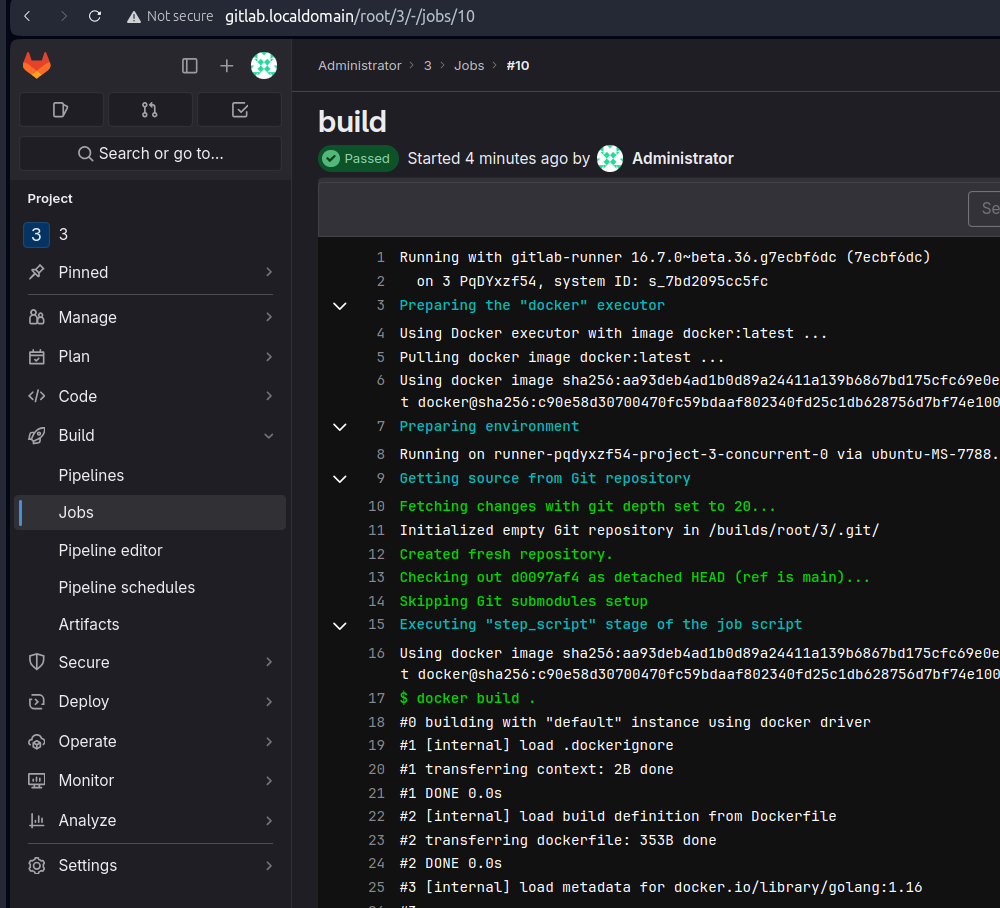

# Домашнее задание к занятию "`8-03`" - `Музыченко Сергей`

---

### Задание 1

1. `Разверните GitLab локально, используя Vagrantfile и инструкцию, описанные в этом репозитории.`

2. `Создайте новый проект и пустой репозиторий в нём.`

3. `Зарегистрируйте gitlab-runner для этого проекта и запустите его в режиме Docker. Раннер можно регистрировать и запускать на той же виртуальной машине, на которой запущен GitLab.`

---

### Задание 2

1. `Запушьте репозиторий на GitLab, изменив origin. Это изучалось на занятии по Git.`

2. `Создайте .gitlab-ci.yml, описав в нём все необходимые, на ваш взгляд, этапы.`

---
